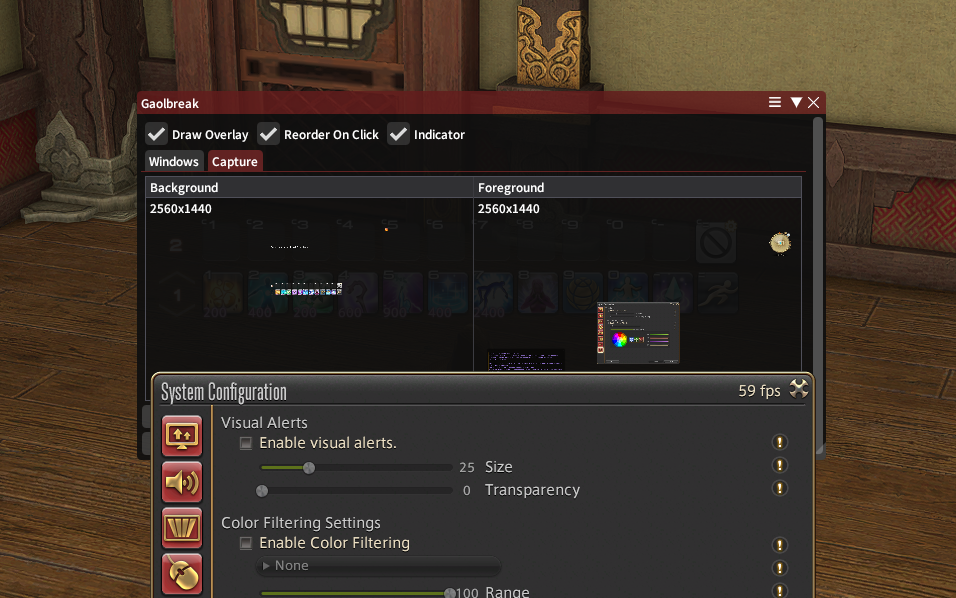

# Gaolbreak UI
A [Dalamud](https://github.com/goatcorp/Dalamud) plugin that breaks FFXIV's UI out of its gaol. Gaolbreak captures the native game UI and displays it as a plugin window.

## Features

* Layer game windows with plugin windows
* Pin plugin windows to game windows
* Prevent ReShade or other graphics effects from affecting the UI
* Allow 3D overlay plugins to draw under the game's UI
* "Indicator" dot on top left shows current status
  * Green - Enabled
  * Yellow - Inactive due to game state
  * Red - Disabled
  * Left click is a killswitch
  * Right click opens the plugin config 
 

## Installation
* Repository: https://puni.sh/api/repository/sourpuh
* If you don't know how to use custom repositories, follow "Download" instructions on https://puni.sh/directory/sourpuh/gaolbreak

## Known issues
* TintAdjust effects (Gamma and Color Filters) do not apply to Gaolbreak UI like it does the native UI.

## Support
If you found a bug or have suggestions for the plugin, please do one of the following:

1. Check if a [GitHub issue](https://github.com/sourpuh/ffxiv_gaolbreak/issues) already exists for the same thing.
1. Create a [new GitHub issue](https://github.com/sourpuh/ffxiv_gaolbreak/issues/new). Provide a detailed description of the suggestion or problem (For bugs, include logs or steps to reproduce the issue).
1. Ask in [Puni.sh Discord](https://discord.gg/punishxiv): it might be a known issue or people might be able to help you quickly.
